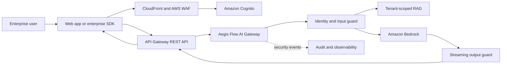

# Aegis Flow

**A multi-tenant, real-time GenAI security and governance gateway for enterprise AI workloads on AWS.**

[](https://aws.amazon.com/)
[](https://aws.amazon.com/bedrock/)
[](https://www.terraform.io/)
[](https://www.python.org/)

> Aegis Flow acts as a security control plane between enterprise applications and foundation models. It validates prompts, enforces tenant-specific policies, intercepts streamed model output, detects potential data exfiltration, and records auditable security decisions before content reaches the client.

## Project Status

This repository is an **architecture prototype under active development**, not a production-ready security product.

| Capability | Status |
|---|---|
| Terraform foundation | Prototype |
| Bedrock streaming invocation | Prototype |
| Input policy enforcement | Planned |
| Streaming output interception | In design |
| Multi-tenant identity and isolation | Planned |
| RAG authorization layer | Planned |
| Audit pipeline and dashboard | Planned |
| Cross-Region recovery | Architecture challenge |

## The Problem

Enterprises increasingly connect internal applications, users, and documents to managed foundation models. Direct model access creates governance questions that the model alone cannot answer:

- Is the caller allowed to use this model and these documents?
- Does the prompt contain credentials, personal data, or restricted information?
- Could a retrieved document belong to another tenant or department?
- Is the generated response leaking sensitive information?
- Can a security team explain why a request was allowed or blocked?
- What happens when the selected model or AWS Region is throttled?

Aegis Flow introduces a centralized enforcement layer for these decisions.

## Product Concept

The intended end product consists of:

1. A secure chat application and administration dashboard.
2. An API and SDK for integration with existing enterprise applications.
3. A multi-tenant AI gateway that authenticates and authorizes every request.
4. Input and output security controls for prompts and streamed responses.
5. Amazon Bedrock integration for managed LLM inference.
6. Tenant-scoped RAG with authorization-aware retrieval.
7. Immutable audit records, metrics, traces, alarms, and cost attribution.

Aegis Flow does **not** train or fine-tune a model. It governs inference requests to managed models through Amazon Bedrock.

## High-Level Architecture



The editable logical architecture is available in [`Aegis-Flow-Architecture.drawio`](./Aegis-Flow-Architecture.drawio).

## Request and Response Flow

1. A user authenticates through Amazon Cognito.
2. The client sends a prompt and JWT to API Gateway.
3. Aegis Flow derives the tenant and user identity from trusted token claims.
4. Tenant policies, model entitlements, quotas, and document permissions are loaded.
5. The input guard checks the prompt for restricted data, secrets, injection attempts, and policy violations.
6. If RAG is required, retrieval is restricted using tenant and authorization metadata filters.
7. The model router selects an approved Bedrock model or inference profile.
8. Bedrock returns model output as a stream of events.
9. Aegis Flow assembles small overlapping buffers and scans them before release.
10. Only validated chunks are streamed to the client.
11. Security decisions, latency, token usage, and correlation metadata are recorded asynchronously.

## Why Streaming Interception Matters

A traditional proxy can inspect a complete response before returning it. That approach increases perceived latency and removes the user experience expected from modern AI applications.

Aegis Flow is designed around **time to first safe token**:

- Model events are decoded as they arrive.
- Small chunks are accumulated in an unpublished tail buffer.
- Overlapping windows prevent sensitive patterns from being split across chunk boundaries.
- Fast deterministic checks run before content is released.
- Higher-cost semantic checks can be applied according to tenant risk policy.
- The stream is terminated and replaced with a safe response when a blocking rule matches.

There is an unavoidable trade-off: a strict no-leak guarantee requires bounded buffering. The design prioritizes security over a theoretical zero-latency pass-through.

## Multi-Tenant Security Model

Tenant isolation must be enforced at every layer, not only in the user interface.

### Identity

- Tenant identity is derived from verified JWT claims, never from an untrusted request-body field.
- Every request carries a correlation ID, tenant ID, user ID, and role context.
- Administrative and inference permissions are separated.

### Data

- DynamoDB keys begin with the trusted tenant identifier.
- RAG retrieval applies mandatory tenant and authorization filters.
- S3 objects and vector records include tenant ownership metadata.
- Encryption is applied in transit and at rest using AWS KMS.

### Runtime

- Lambda request state remains local to the invocation.
- Mutable tenant context must not be stored in module-level global variables.
- IAM roles follow least privilege for model invocation, data access, and audit publishing.
- Logs avoid raw prompts, credentials, and sensitive generated content by default.

## Target AWS Services

| Layer | AWS service | Responsibility |
|---|---|---|
| DNS and edge | Route 53, CloudFront, AWS WAF | DNS, TLS, caching, and edge protection |
| Frontend | Amazon S3 | Static chat UI and administration dashboard |
| Identity | Amazon Cognito | OIDC, JWTs, MFA, tenant and role claims |
| API | Amazon API Gateway | Authentication, throttling, and response streaming |
| Compute | AWS Lambda | Gateway orchestration and policy enforcement |
| Inference | Amazon Bedrock | Managed foundation-model inference |
| AI safety | Bedrock Guardrails | Content and sensitive-information controls |
| Session and policy data | Amazon DynamoDB | Tenant policies, session state, quotas, and idempotency |
| Documents | Amazon S3 | Encrypted enterprise knowledge sources |
| Retrieval | Bedrock Knowledge Bases or a vector store | Tenant-scoped semantic retrieval |
| Events | Amazon EventBridge and Amazon SQS | Decoupled audit and security-event processing |
| Audit archive | Amazon S3 Object Lock | Retained and tamper-resistant audit evidence |
| Observability | CloudWatch and AWS X-Ray | Logs, metrics, traces, dashboards, and alarms |
| Encryption | AWS KMS and Secrets Manager | Keys and managed application secrets |
| Resilience | Bedrock Inference Profiles | Capacity-aware Cross-Region model routing |

## Core Components

### `ai_gateway.py`

The gateway runtime is responsible for:

- receiving an authenticated inference request;
- constructing the Bedrock payload;
- invoking the configured model through the Bedrock Runtime API;
- decoding the Bedrock event stream;
- passing generated text through the output inspection pipeline;
- emitting validated response chunks to the upstream integration;
- translating throttling, validation, and runtime failures into safe API errors.

### `main.tf`

Terraform defines the initial AWS infrastructure and IAM permissions required by the prototype. The target state is a reusable module structure with explicit environment and Region configuration.

### Planned Security Engine

The security engine will evaluate versioned, tenant-specific policies for:

- PII and regulated-data detection;
- credential and secret detection;
- prompt-injection indicators;
- model and Region allowlists;
- document-level authorization;
- token, cost, and rate limits;
- response blocking, masking, or review workflows.

## Cross-Region Resilience

Bedrock Cross-Region Inference Profiles can route model invocations across approved Regions. Aegis Flow stores the canonical conversation outside the model so that execution remains recoverable.

The managed Bedrock API does not expose a portable live KV cache. Therefore, Aegis Flow does not claim seamless migration of an active generation. If a stream fails:

1. The failed attempt is marked using an idempotency key.
2. The last safely released output offset is retained.
3. Canonical messages, tool results, RAG citations, and prompt versions are loaded from durable state.
4. The request is replayed through an approved fallback path.
5. The client receives either a controlled retry or an explicit recovery event.

This is **recoverable failover**, not live model-state migration.

## IAM Strategy for Multi-Region Bedrock

Least-privilege model invocation requires more than a wildcard Bedrock permission. The Terraform configuration should generate:

- the approved inference-profile ARN;
- the corresponding foundation-model ARN in every permitted destination Region;
- only the required invocation actions;
- an `aws:InferenceProfileArn` condition where appropriate.

Provider aliases deploy infrastructure into multiple Regions. They do not perform runtime model routing; that responsibility belongs to the selected Bedrock inference profile.

## Repository Layout

```text
.
├── README.md
├── Aegis-Flow-Architecture.drawio
├── ai_gateway.py
├── main.tf
└── requirements.txt
```

The planned production-oriented structure is:

```text
.
├── apps/
│   ├── web/
│   └── admin/
├── services/
│   ├── ai_gateway/
│   ├── policy_engine/
│   ├── audit_worker/
│   └── rag_retriever/
├── infrastructure/
│   ├── modules/
│   └── environments/
├── tests/
│   ├── unit/
│   ├── integration/
│   ├── security/
│   └── load/
├── docs/
└── .github/workflows/
```

## Local Prerequisites

- Python 3.11 or newer
- Terraform 1.6 or newer
- AWS CLI v2
- An AWS account with Amazon Bedrock model access
- AWS credentials with explicitly scoped deployment permissions

## Prototype Setup

### 1. Clone the repository

```bash
git clone https://github.com/rajin1111/aegis-flow-governance.git
cd aegis-flow-governance
```

### 2. Create a Python virtual environment

```bash
python -m venv .venv
source .venv/bin/activate
pip install -r requirements.txt
```

On Windows PowerShell:

```powershell
python -m venv .venv
.venv\Scripts\Activate.ps1
pip install -r requirements.txt
```

### 3. Configure AWS credentials

```bash
aws configure
aws sts get-caller-identity
```

Do not commit credentials, `.env` files, Terraform state, or generated deployment packages.

### 4. Review and deploy Terraform

```bash
terraform init
terraform fmt -check
terraform validate
terraform plan
terraform apply
```

The exact variables and outputs will evolve as the infrastructure is modularized. Always inspect the Terraform plan before applying it.

## Validation Strategy

A security gateway is only credible when its failure behavior is tested. Planned validation includes:

- Unit tests for event decoding and policy decisions.
- Chunk-boundary tests for secrets split across multiple stream events.
- Tenant-isolation tests using conflicting tenant identifiers.
- IAM negative tests proving unauthorized models cannot be invoked.
- Prompt-injection and document-poisoning test cases.
- Load tests measuring time to first safe token and stream throughput.
- Throttling and Region-failure simulations.
- Audit completeness and sensitive-log-redaction tests.
- Terraform formatting, validation, scanning, and policy-as-code checks in CI.

## Key Metrics

| Metric | Purpose |
|---|---|
| Time to first safe token | User-perceived latency after security inspection |
| Guard evaluation latency | Cost of input and output controls |
| Block and redact rate | Policy activity by tenant and rule version |
| Bedrock throttling rate | Capacity and routing health |
| Tokens and cost per tenant | Usage governance and chargeback |
| Retrieval authorization denials | Attempted access to unauthorized knowledge |
| Stream interruption rate | Reliability of the end-to-end response path |

## Architecture Challenges

### 1. Dual-Streaming Interception

How can Aegis Flow inspect generated text before release while preserving low time to first token and detecting sensitive patterns that cross event boundaries?

Current direction: overlapping bounded buffers, deterministic first-pass DLP, risk-based semantic inspection, and explicit time-to-first-safe-token objectives.

### 2. Cross-Region Incomplete Generation Recovery

How should an interrupted generation recover when managed model execution state cannot be exported?

Current direction: external canonical conversation state, idempotent attempts, Cross-Region Inference Profiles, safe output checkpoints, and explicit retry semantics.

### 3. Dynamic Multi-Region Least Privilege

How can Terraform generate exact model and inference-profile permissions as model availability and approved Regions change?

Current direction: validated model-to-Region maps, generated ARN sets, policy conditions, automated IAM tests, and deny-by-default deployment controls.

## Roadmap

### Phase 1 — Demonstrable Vertical Slice

- [ ] Deploy the API and streaming Lambda through Terraform.
- [ ] Add a minimal chat frontend.
- [ ] Integrate Cognito authentication.
- [ ] Implement one input rule and one output DLP rule.
- [ ] Stream an allowed Bedrock response to the browser.
- [ ] Block a simulated secret before it reaches the browser.
- [ ] Record a sanitized audit event.

### Phase 2 — Multi-Tenant Governance

- [ ] Tenant policy storage and versioning.
- [ ] Role- and model-based authorization.
- [ ] Usage quotas and cost attribution.
- [ ] Security administration dashboard.
- [ ] Tenant-scoped RAG with document authorization.

### Phase 3 — Enterprise Resilience

- [ ] Cross-Region inference and recovery tests.
- [ ] DynamoDB Global Tables for durable session state.
- [ ] Immutable audit retention.
- [ ] Security Hub or SIEM integration.
- [ ] Load, chaos, and penetration testing.
- [ ] SLOs, dashboards, and operational runbooks.

## Threat Model Summary

Aegis Flow is designed to reduce risks including:

- cross-tenant data exposure;
- prompt injection and instruction override attempts;
- sensitive-data exfiltration through generated output;
- unauthorized RAG document retrieval;
- over-permissive model invocation roles;
- sensitive prompt or response content in logs;
- replay and duplicate inference attempts;
- unbounded tenant cost or token consumption.

It does not claim to eliminate all model risk. Controls must be tested against the specific models, data classes, workloads, and compliance requirements of each deployment.

## Design Principles

- **Deny by default.** Missing tenant, model, or document authorization fails closed.
- **Time to first safe token.** Streaming speed is measured after enforcement.
- **Identity before policy.** All decisions use verified identity context.
- **No implicit tenant state.** Isolation is explicit in every storage and retrieval operation.
- **Models are ephemeral executors.** Durable state lives outside the model runtime.
- **Auditable decisions.** Every allow, redact, and block action has a policy version and correlation ID.
- **Infrastructure as Code.** Environments are reproducible and reviewable through Terraform.

## Disclaimer

Aegis Flow is an educational architecture and engineering prototype. It has not been independently security-assessed and must not be treated as a compliance certification, data-loss-prevention guarantee, or production security boundary without additional design review, testing, and operational controls.

## License

No license has been selected yet. Until a license is added, all rights remain with the repository owner.
